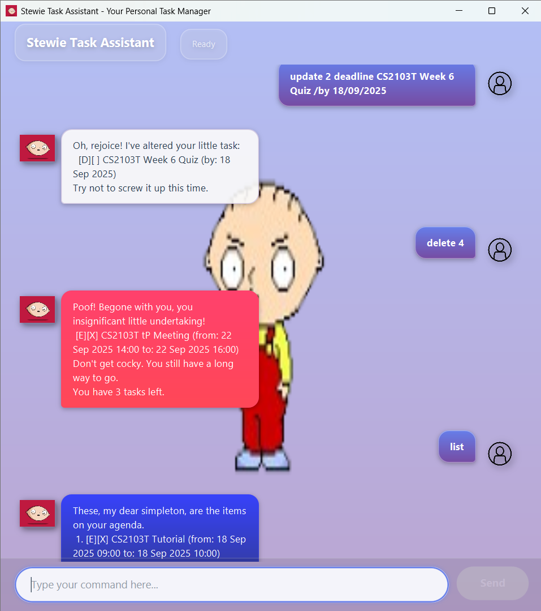

# Stewie User Guide 🤖



Stewie is a text-based GUI personal assistant that helps you manage your day.  
>*"Mom, mom, mom, mommy, mom, mom, mom..." – Stewie*

---

## Installation Guide

1. Download the JAR package (v1.1.1) from [here](https://github.com/Jav65/ip/releases).
2. Run it with:
   ```bash
   java -jar stewie.jar
   ```

---

## Commands Overview

- `list`
- `mark <i>`
- `unmark <i>`
- `todo <desc>`
- `deadline <desc> /by <dd/MM/yyyy> [HH:mm]`
- `event <desc> /from <dd/MM/yyyy> [HH:mm] /to <dd/MM/yyyy> [HH:mm]`
- `delete <i>`
- `find <keyword>`
- `update <i> <todo|deadline|event> <desc> ...`
- `bye`

---

## 📋 Listing Tasks

**Usage:**
```
list
```

Displays the current list of tasks.

**Example:**
```
list
```

**Results:**
```
 Here’s what you’ve got piling up:
  1. [T][ ] Buy milk
  2. [D][X] CS2103T Quiz (by: 18 Sep 2025 23:59)
  3. [E][ ] Meeting (from: 20 Sep 2025 10:00 to: 20 Sep 2025 12:00)
 Failure is not an option.
 You have 3 tasks left
```

---

## ✅ Marking Tasks as Done

**Usage:**
```
mark <index>
```

Marks the task at the given index as done.

**Example:**
```
mark 1
```

**Results:**
```
 Behold! I've declared this paltry task complete.
  [T][X] Buy milk
 Don't get cocky. You still have a long way to go.
```

---

## ❌ Unmarking Tasks

**Usage:**
```
unmark <index>
```

Marks the task at the given index as **not done**.

**Example:**
```
unmark 1
```

**Results:**
```
 You're toying with me! I've marked this back as incomplete.
  [T][ ] Buy milk
 Don't think for a second I'll forget this betrayal.
```

---

## 📝 Adding ToDo Tasks

**Usage:**
```
todo <desc>
```

Adds a new to-do task.

**Example:**
```
todo Finish reading book
```

**Results:**
```
 I've scribbled down your little task:
  [T][ ] Finish reading book
 Now, do try to keep up, won't you?
 You have 6 tasks left.
```

---

## ⏰ Adding Deadline Tasks

**Usage:**
```
deadline <desc> /by <dd/MM/yyyy> [HH:mm]
```
*[HH:mm] is optional. If you omit it, the deadline will default to 00:00.*

Adds a new deadline task.

**Example:**
```
deadline CS2103T Quiz /by 18/09/2025
```

**Results:**
```
 I've scribbled down your little task:
  [D][ ] CS2103T Quiz (by: 18 Sep 2025)
 Now, do try to keep up, won't you?
 You have 5 tasks left.
```

---

## 📅 Adding Event Tasks

**Usage:**
```
event <desc> /from <dd/MM/yyyy> [HH:mm] /to <dd/MM/yyyy> [HH:mm]
```
*[HH:mm] is optional. If you omit it, the deadline will default to 00:00.*

Adds a new event task.

**Example:**
```
event Meeting /from 20/09/2025 10:00 /to 20/09/2025 12:00
```

**Results:**
```
 I've scribbled down your little task:
  [E][ ] Meeting (from: 20 Sep 2025 10:00 to: 20 Sep 2025 12:00)
 Now, do try to keep up, won't you?
 You have 7 tasks left.
```

---

## 🗑️ Deleting Tasks

**Usage:**
```
delete <index>
```

Deletes the task at the given index.

**Example:**
```
delete 2
```

**Results:**
```
 Poof! Begone with you, you insignificant little undertaking!
  [D][ ] CS2103T Quiz (by: 18 Sep 2025 23:59)
 Don't get cocky. You still have a long way to go.
 You have 4 tasks left.
```

---

## 🔍 Finding Tasks

**Usage:**
```
find <keyword>
```

Searches for tasks containing the keyword.

**Example:**
```
find Quiz
```

**Results:**
```
 Hmph! Here are the pathetic, insignificant plans that you requested.
  1. [D][ ] CS2103T Quiz (by: 18 Sep 2025 23:59)
  2. [D][ ] ST2334 Quiz (by: 20 Sep 2025)
 Found 2 tasks in total. 
```

---

## ✏️ Updating Tasks

**Usage:**
```
update <index> <todo|deadline|event> <desc> ...
```

Updates the task at the given index with new details.
- `todo <desc>`
- `deadline <desc> /by <dd/MM/yyyy> [HH:mm]`
- `event <desc> /from <dd/MM/yyyy> [HH:mm] /to <dd/MM/yyyy> [HH:mm]` 

*[HH:mm] is optional. If you omit it, the deadline will default to 00:00.*

**Example (update to deadline):**
```
update 1 deadline CS2103T Finals /by 30/11/2025 23:59
```

**Results:**
```
 Oh, rejoice! I've altered your little task:
  [D][ ] CS2103T Finals (by: 30 Nov 2025 23:59)
 Try not to screw it up this time.
 
```

---

## 👋 Exiting Stewie

**Usage:**
```
bye
```

Exits the application.

**Example:**
```
bye
```

**Results:**
```
Finally, you're leaving. Do try not to get lost on the way out.
```
